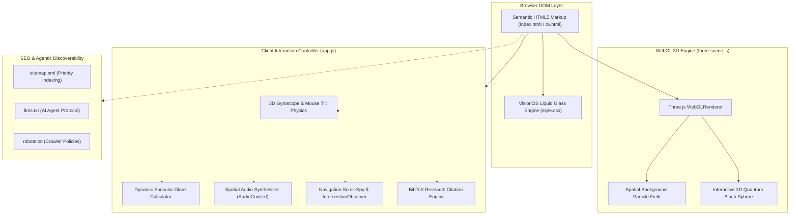

<div align="center">

# Ali Nasser — Personal Engineering Portfolio & Spatial Web Experience

[](https://developer.mozilla.org/en-US/docs/Web/HTML)
[](https://developer.mozilla.org/en-US/docs/Web/CSS)
[](https://developer.mozilla.org/en-US/docs/Web/JavaScript)
[](https://threejs.org/)
[](https://pages.github.com/)
[](LICENSE.txt)

<p align="center">
  The official portfolio and interactive systems showroom for <b>Ali Nasser</b>, engineered with <b>Apple VisionOS liquid glass aesthetics</b>, hardware-accelerated <b>Three.js WebGL spatial canvases</b>, and an interactive <b>3D Quantum Bloch Sphere</b>.
</p>

<p align="center">
  <b>Production Domain:</b> <a href="https://www.ali-nasser.dev">www.ali-nasser.dev</a>
</p>

</div>

---

## Table of Contents
- [Overview](#overview)
- [Architecture & Rendering Pipeline](#architecture--rendering-pipeline)
- [Core Engineering Highlights](#core-engineering-highlights)
- [Spatial Design System & UI Tokens](#spatial-design-system--ui-tokens)
- [SEO, Accessibility & AI Discovery](#seo-accessibility--ai-discovery)
- [Tech Stack](#tech-stack)
- [Project Structure](#project-structure)
- [Local Development](#local-development)
- [Author & License](#author--license)

---

## Overview

**AliNasser'sWebsite** (`www.ali-nasser.dev`) is a single-page progressive web portfolio engineered from first principles without bulky JavaScript UI frameworks. Designed to embody Apple's spatial VisionOS design language, the platform features dynamic liquid glass morphism, specular glare tracking, spatial audio feedback cues, and real-time 3D WebGL visualizations showcasing autonomous robotics, cryptographic tools, and quantum simulation software.

### Key Goals
- **Zero-Dependency Core Performance:** Sub-second First Contentful Paint (FCP) and near-zero Total Blocking Time (TBT).
- **Interactive 3D Quantum Demonstration:** Embedded WebGL simulation of the quantum state space (Bloch Sphere).
- **Comprehensive Engineering Portfolio:** Integrated project showcases, interactive ATS-compatible resume (`cv.html`), and research citation generators.

---

## Architecture & Rendering Pipeline



---

## Core Engineering Highlights

### 1. Apple VisionOS Liquid Glass Engine (`style.css`)
- Multi-layer `backdrop-filter: blur(24px)` with high-refraction specular borders (`rgba(255, 255, 255, 0.18)`).
- Cursor-following ambient illumination and 3D card tilt physics driven by matrix transformations.

### 2. Three.js WebGL Spatial Canvas (`three-scene.js`)
- **Liquid Background Canvas:** Low-overhead WebGL particle mesh that subtly warps and ripples in response to pointer velocity.
- **3D Quantum Bloch Sphere:** Interactive visualization of a single qubit state vector:
  $$|\psi
angle = \cos\left(rac{	heta}{2}
ight)|0
angle + e^{i\phi}\sin\left(rac{	heta}{2}
ight)|1
angle$$
  Renders coordinate axes ($X, Y, Z$), superposition state trajectories, and dynamic orbital camera controls.

### 3. Spatial Audio & Haptic Feedback (`app.js`)
- Synthesized Web Audio API sound cues for button presses, theme toggles, and modal activations with zero external audio assets.

### 4. Interactive ATS Resume Engine (`cv.html`)
- Dedicated printable and screen-reader-optimized curriculum vitae with direct PDF export triggers and structured schema.org JSON-LD microdata.

---

## Spatial Design System & UI Tokens

The visual design system is calibrated for dark, high-contrast, modern spatial interfaces:

| Token Variable | Description | Hex / RGBA Code | Usage |
| :--- | :--- | :--- | :--- |
| `--bg-canvas` | Deep Space Obsidian | `#07090E` | Root Canvas Background |
| `--glass-surface` | Translucent Liquid Slate | `rgba(18, 26, 36, 0.65)` | Card & Modal Containers |
| `--accent-apple-blue`| Electric Cupertino Blue | `#0A84FF` | Primary Interactive Elements & CTAs |
| `--accent-neon-green`| Telemetry Bright Green | `#30D158` | Status Indicators & Live Badges |
| `--text-primary` | High-Contrast Polar White | `#F5F5F7` | Headings & Body Typography |
| `--text-secondary` | Muted Silver Ash | `#86868B` | Subtitles, Tags & Captions |

---

## SEO, Accessibility & AI Discovery

- **`llms.txt` Integration:** Conforms to the emerging `llms.txt` specification, providing structured markdown summaries for autonomous AI agents and LLM crawlers.
- **Sitemap & Semantic Indexing:** `sitemap.xml` with canonical links to `https://www.ali-nasser.dev/`.
- **WCAG 2.1 AA Compliance:** High contrast ratios, accessible ARIA labels, and keyboard navigation support.

---

## Tech Stack

| Domain | Technology | Purpose |
| :--- | :--- | :--- |
| **Markup & Semantics** | HTML5 Semantic Elements | Document Structure & Microdata |
| **Styling & Layout** | Modern CSS3 (Grid, Flexbox, Custom Properties) | VisionOS Glassmorphism & Animations |
| **3D Rendering** | Three.js (WebGL) | Particle Canvas & Quantum Bloch Sphere |
| **Interaction Logic** | Vanilla JavaScript (ES6+) | Tilt Physics, Audio & Modals |
| **Web Server & CDN** | GitHub Pages CDN | Global Edge Distribution & Custom Domain |
| **Domain & DNS** | Cloudflare / Custom DNS | HTTPS & `www.ali-nasser.dev` Resolution |

---

## Project Structure

```
AliNasser'sWebsite/
├── index.html                       # Main Spatial Portfolio Experience
├── cv.html                          # Interactive ATS Curriculum Vitae
├── style.css                        # VisionOS Design System & Animations
├── cv-style.css                     # CV Layout & Print Stylesheet
├── three-scene.js                   # WebGL Canvas & Bloch Sphere Engine
├── app.js                           # UI Interactions, Audio & Micro-Animations
├── sitemap.xml                      # Canonical Search Engine Sitemap
├── robots.txt                       # Web Crawler Instructions
├── llms.txt                         # AI Agent / LLM Ingestion Protocol
├── favicon.ico                      # Brand Icon Asset
├── images/                          # Profile, Certifications & Media
│   ├── avatar.jpeg
│   └── gdsc-certificate.png
├── assets/                          # Static Fonts, CV Downloads & PDF Files
│   ├── Ali_Nasser_CV.pdf
│   ├── Ali_Nasser_ATS_CV.pdf
│   └── webfonts/
└── README.md                        # Technical Documentation
```

---

## Local Development

### Prerequisites
- Modern web browser (Chrome, Safari, Edge, or Firefox)
- Local HTTP server (e.g., Python `http.server`, Node `serve`, or VSCode Live Server)

### Running Locally

1. **Clone the repository:**
   ```bash
   git clone https://github.com/a360n/a360n.github.io.git
   cd a360n.github.io
   ```

2. **Start a local development server:**
   ```bash
   # Using Python 3
   python3 -m http.server 8080
   
   # Or using Node.js
   npx serve .
   ```

3. **Open in your browser:**
   Navigate to `http://localhost:8080` to experience the spatial portfolio.

---

## Author

**Ali Nasser (Ali Al-Khazali)**
- Portfolio: [www.ali-nasser.dev](https://www.ali-nasser.dev)
- GitHub: [@a360n](https://github.com/a360n)
- LinkedIn: [Ali Nasser](https://www.linkedin.com/in/ali-nasser-dev/)

---

## License

This project is licensed under the MIT License — see the [LICENSE.txt](LICENSE.txt) file for details.
